# Deep learning Hardware
This guide is intended for beginers in hardware, in order to plan what you need and how to choose parts for a computer specialized in Deep Learning.

Feel free to open an issue is there is any mistakes or any questions :)

**note: I've built more than 10 computers and owned twice as much for lots of usages (HTPC, gaming, ultralight, servers, IOT device, etc), I'm also a huge fan of computer hardware, so I guess this guide is reliable ^^**.

## Table of content:
- [I'm a beginner / I'm a student](./HardwareforAI#im-a-beginner--im-a-student)
- [Laptop vs Cloud vs Prebuild vs Homemade](./HardwareforAI#laptop-vs-cloud-vs-prebuilt-vs-homemade)
	- [Laptops](./HardwareforAI#pro-and-con-of-beefy-laptop)
	- [Cloud computing](./HardwareforAI#cloud-computing)
	- [Prebuild](./HardwareforAI#prebuild)
	- [Homemade](.HardwareforAI#homemade)
- [The bottom-up approach: What kind of harware exist, and how to choose it](./HardwareforAI#the-bottom-up-approach-what-kind-of-harware-exist-and-how-to-choose-it)
	- [Why GPU are so efficient ?](./HardwareforAI#why-gpu-are-so-efficient-)
	- [Choosing a GPU](./HardwareforAI#choosing-a-gpu)
	- [Choosing a CPU](./HardwareforAI#choosing-a-cpu)
	- [Choosing a motherboard](./HardwareforAI#choosing-a-motherboard)
	- [RAM](./HardwareforAI#ram)
	- [Storage](./HardwareforAI#storage)
	- [Cooling the beast](./HardwareforAI#cooling-the-beast)
	- [Power Supply](./HardwareforAI#psu)
	- [LEDS](./HardwareforAI#led)
	- [Fans](./HardwareforAI#fan)
	- [Case](./HardwareforAI#case)
	- [Other](./HardwareforAI#other)
	- [OS](./HardwareforAI#os)
- [TLDR: some build examples](https://github.com/MaelAbgrall/HardwareforAI/blob/master/README.md#tldr-some-examples)

**Some additionnal contents:**
- [ASIC & SOC / Embedded systems](./HardwareforAI#asics--soc-embedded-systems)
- [Youtubers to follow & Useful links](./HardwareforAI#youtubers-to-follow--useful-links)

## TODO list:
	- Building guide
	- Deep learning asic & embedded chips
	- Resize images & better diagrams

## latest update:
	- Added some configuration ideas
	- modifications on storage
	- benchmark link for 1080ti vs 2080/2080ti

## I'm a beginner / I'm a student
you don't need a powerful computer (unless you're a gamer).

There is plenty of cloud based solutions that will offer free computing power for a limited time. And even when you are out of free options, it is still a viable option.

If you are learning computer science (and not AI especially), it is better to have a powerful laptop with at least an i5 and integrated GPU. It will allow you to do some small program without the need of bigger machines

## Laptop vs Cloud vs Prebuild vs Homemade
Before going any further, here is how I'm working with AI:

- I have a small laptop with enough power to do some small computation or small software (like websites for example). It's a thinkpad x230 under Fedora, and it serve me well since 2012, it's ultra light and very small, and I'm not planning to change it anytime soon.
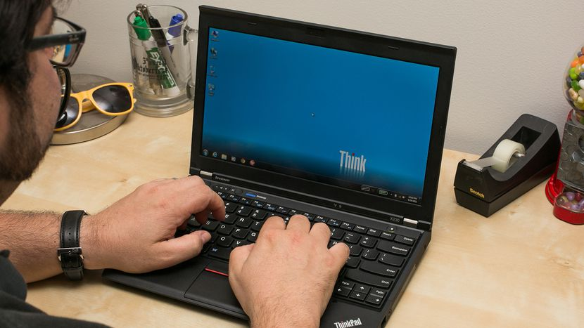
	*an idea of the size of the x230*
- I have also a small tower with a beefy GPU (1080ti) for heavy computation, photoshop and gaming. I'm planning to upgrade it during summer 2018 for a dual GPU water cooled system. It's running dual boot with windows, and Fedora.

When I'm not on my big computer, I'm using SSHFS and tunnels to work. It's easy to set up and it can replace easily cloud options.

#### Pro and con of beefy laptop
Sadly, a lot of people out here recommend to get a gaming laptop for AI.

From personal experience, it is already a somewhat bad choice for gaming, so do not expect to do heavy computation on those laptop !

why ? If you did some thermal / energy engineering, you should probably know about the things I'll talk here

When you are running heavy computation (Games, AI, video rendering, etc) you are using a lot of power. Since our world is not perfect, while doing this you loose some power in form of heat (in electronics it's called TDP and it's in Watt)

So, when you have a laptop, your "cooling potential" aka the size of the heat exchanger / Radiator is small. Thus your laptop fans will need to run full speed to dissipate this heat. And even at full speed, it's not really efficient.

Pro:
- If you don't have internet, you can still work on AI
- After cloud computing, Tight budget friendly

Con:
- Really short lifespan (due to overheat, and smaller component)
- During training, you won't do favors to the battery, either because it's plugged for several hours, or because it's drawing a massive amount of power
- Thermal overload (your computer will slow down to not literally burn, thus longer training time)
- Really noisy & hot
- you can't upgrade it
- Not the best for performance / $

#### Cloud computing
Cloud computing is a good option if you don't have a budget or if you are not serious about AI. However, in the long run it's very expensive, so if you are using it daily, see the next two parts.

**Beware that this guide is intended for personal / small team use case (I'm working with 5 / 6 coworker on a xeon / 4 titan Xp server). For larger use case (team of 20+ peoples), this guide is not relevant!**

**For companies (start up and small ones)**, on case you didn't know, the most intensive part about AI is training a model. This is when you need a big computer with really powerful hardware. During prediction (for example when used by an end-user) the amazing thing is that you don't need powerful computers (yes, you can run a model on a mobile phone). So, again, for a small/medium team, building your own computer is the most affordable case in the long run (>1y, do not use a DIY for a MVP). Since it's also a server not designed for usage by end user (so no website hosting on it) you can very easily protect it and maintain it (just put it in a LAN/VLAN, and deny any connection from outside the building)

pro:
- no need for maintenance (you can start a training in less than 15min)
- access to pro-level hardware for cheap
- easily scalable for large teams

con:
- very expensive if you use it daily

#### Pre-build
Those computer are very powerful usually. There is two type of prebuilds: the ones by big companies (Asus, MSI, etc) and the ones built by smaller professionals

Prebuilds from big companies share con with beefy laptop

Other prebuilds can really worth it, however you need to pay for the guys who will build it, and sometimes you can't go with some particular options.

#### Homemade
The best option out here. You will put only what you need on your computer, this will allow a very wise usage of your money.

For those afraid of building a computer: it's not difficult (12yo children can do it, so you probably can), and it's not very time consuming (you need to plan maximum a week end, and minimum an afternoon)

Pro:
- Only what you need
- You can upgrade it as hardware is evolving (you only need to change a few parts, and keep 90% of your initial build)
- Depending the hardware, it can be silent, or extremely silent
- It's very efficient, because you will never have thermal overload.
- You can make a VERY powerful computer (aka 8 GPU)

Con:
- It's very heavy
- It's big
- It's more efficient than a vacuum cleaner, so you need some cleanup roughly every 3 months (it's not mandatory, but you can loose performance if it's too dusty)

when you are using a homemade setup, if you are outside, you only need an internet connection and a small laptop to connect to it. You may even not need to buy a new laptop because you are probably reading this on a portable "computer" (aka something with a keyboard is enough).
Even a chromebook will be sufficient to work.

If you really want to buy a new laptop, there is very good Linux laptops out here, Clevo notebooks are really worth it (the original AlienWare were build with Clevo notebooks), and some re-vendors like System 76 in the US are supporting Linux

## The bottom-up approach: What kind of hardware exist, and how to choose it
To build a computer you will need at least a motherboard, a CPU, Ram, and stockage (HDD / SSD / M2).
Some CPU (Intel primarily) have integrated graphics. It's a very weak GPU, but it's enough for rendering a desktop environment and basic applications (Office, internet, etc)

### Why GPU are so efficient ?
GPU is a specialized piece of hardware (back in the old days, every piece of a computer were plug-able, so you could design a good computer by putting less or more card, like LAN card, sound card, etc. This is still the case today)

GPU are not really efficient for all tasks: if you need heavy computation, or a state machine with instructions that depends from the result of previous ones, CPU are still more efficient.
GPU are somewhat good to do basic calculation.

When you take ONE GPU core, it's much slower than a CPU core.
However the incredible power of a GPU is there is a lot of core. So when you have a problem that can be parralelized (example render pixels) they are much more efficient than CPU.

Deep learning tasks can be parralelized, this is why you need a GPU

At last, GPU have a special kind of memory (GDDR) which is at very high speed, so comunication between GPU <-> GDDR is faster than CPU <-> RAM

If you want an example: I did a training with my old x230 on MNIST. Since this laptop don't have a discrete GPU (aka a GPU separated from the CPU) it took nearly 3 day.
On my big computer, it took 5 minutes

### Choosing a GPU

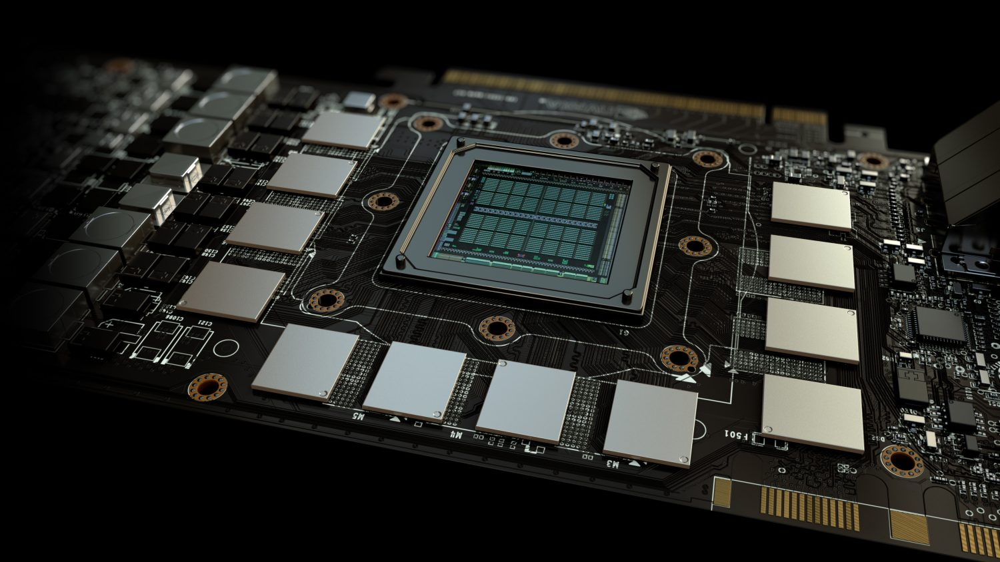

*this square on the middle is the graphic chip. the smaller squares around it are voltage regulators (VRM) and the memory*

When you are building a deep learning focused computer, the main concern is the GPU, how many ? how efficient ?

2 things are important in a GPU (the more, the better):
- Memory: Less memory mean either smaller batch, or only one model at a time
- Processing power (in GFLOPs): this is the number of operation per second

Processing power is usually constrained by the number of cuda cores, clock speed and GDDR bandwidth.

You can find all nvidia's gpu datasheet [here for 9xx series](https://en.wikipedia.org/wiki/List_of_Nvidia_graphics_processing_units#GeForce_900_series) and [here for the 10xx series](https://en.wikipedia.org/wiki/List_of_Nvidia_graphics_processing_units#GeForce_10_series)

of course, is you can afford one, the Titan V is well above the other cards in term of processing power.

update: [https://www.pugetsystems.com/labs/hpc/NVIDIA-RTX-2080-Ti-vs-2080-vs-1080-Ti-vs-Titan-V-TensorFlow-Performance-with-CUDA-10-0-1247/](here) is a quick benchmark for 1080ti vs 2080 and 2080ti. Both ti version have 11Gb of DRAM while the 2080 only have 8Gb. And the 2080 & 2080ti have Tensorcores (usually found in the Titan V)

Depending on the size of your datasets and the number of experiment you need to conduct at the same time, you can either go with one beefy GPU or two smaller ones (or if you can afford it, two big GPU).
	
	Since you can upgrade your computer later, a tight budget choice would be to use everytime two gpu: one powerful and one less powerful / older. 
	
	- You will be able to train multiple models at the same time on both cards for testing, and use the most powerful for more longer training. 
	- you will also be able later to upgrade only one gpu at a time (always change the older when buying new hardware)
	
	*note*: I'm not sure you can play video games on this kind of setup, however for computation it is fine to have two, three, four or more different cards on the same computer

For example, with a titan Xp (12GB) you can train 5 CIFAR datasets at the same time with batches of 500 images.

some simple math to estimate roughly your GPU memory need: Batch size(int) * image size(KB/MB) = more or less the ram needed during training

Also note that previous generation hardware (ex 980ti) are also a good value, and still efficient

If you are choosing between Nvidia and AMD, at the moment, Nvidia is much more advanced on AI than AMD, so there is no doubt: go for Nvidia

Last note on GPUs:
Going for 1 or 2 GPU is okay, if you plan to put more than 2 GPU, it will cost you much more to run it (explanation on the next part)

### Choosing a CPU
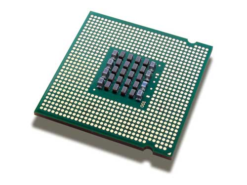

*backside of a CPU, those little dots will connect to the socket*

Choosing a CPU for AI is not the same as choosing a CPU for gaming.

When you are gaming, GPU performances are bounded to the CPU ability since a lot of work is done on the CPU. When you use a less efficient CPU: the GPU is waiting for CPU instructions

Since AI don't need the same computation, you do not have the issue of bottleneck. I still recommend at least an i5 / Ryzen 5 / equivalent

How is CPU used in AI ? Usually the CPU is used for data augmentation before sending it to the GPU.
In the deep learning case, the slower part of the software is the training, and it's happening on the GPU. Since even the best GPU will not train as fast as a CPU can do data augmentation, you will never experience bottleneck.

#### Number of core
the number of core in a CPU is not very relevant for AI, it is interesting to have more than 2 cores for prepairing batches of data. Unless you use very heavy multi-threaded pre-processing or if there is multiple users on the same computer, the need of more than 4 cores is not relevant (it is still better to search for a fast CPU than a huge number of cores).
If you plan to use >=3 GPU, nearly all CPU that can handle this have more than 8 cores

#### the generation
You should check first the generation of the CPU: newer CPU are more power efficient than older ones, this mean reducing the electric bill, and increase performances. Be careful i7 i5 Ryzen 5 / 7 is not the generation, it is the performance indicator.
	example:
- i7 7700 is generation 7
- i5 8600 is generation 8

the performance scale is as follow:
	
	lesser CPU (celeron, etc) < i3 / Ryzen 3 < i5 / Ryzen 5 < i7 / Ryzen 7 < i9 / Threadripper
	
Intel Xeon and AMD Athlon/Epyc are special kind of CPU, usually not affordable and reserved for datacenters (lot of core, but not very fast)

#### PCIE Lanes
the number of pcie lanes. Usually CPU (5 & 7 series) will come with 16 lanes. pcie lanes are the communication pipes between the CPU and the GPU. A GPU will take maximum 16 lanes, and (for CUDA based application) minimum 8 lanes.

Having only 16 lanes, those GPU need to divide them between the two GPU if you have two. This mean a 10% decrease in performance. **It is not an issue, and I believe that the next PCIE generation will enhance this**. 

If you need to plug more GPU, you need more lanes. Be careful though, splitting lanes is not even (for example the i7 X series have 28 lanes. However it is split in 16x 8x 4x, so you won't be able to put a third GPU) Usually the only CPUs allowing enough lanes for 3+ GPUs are i9 / Threadripper. However it is nearly twice the price of an i7 and the motherboard you will need is also more expensive.
if you need 4+ GPU, there is still a way to do it using Xeon / Athlon processors. Motherboards that are compatible with those CPU are also able to fit two CPU. However, this come at a very high price (it seems however that used datacenter hardware is more affordable)

*The following diagram is not accurate (we will see why later), but you get the idea about GPUs. This is a Threadripper*
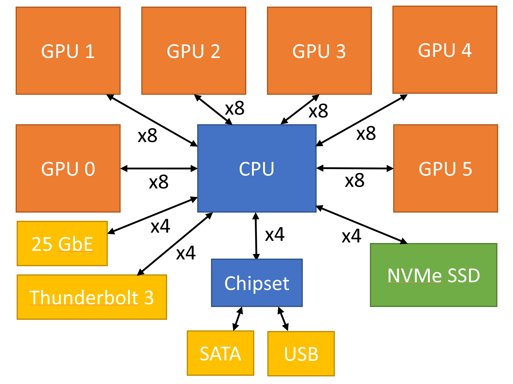

#### Overclocking
some CPU are overclockable.
This is a special feature for gamers: it allow overclocking your CPU. However this is a really bad idea in computation since this increase chances to have bit errors. **It's a no no.**

in gaming this is not an issue, because bit errors are not visible.

so this little feature is not really useful, and you will pay for it. The other downside is that you MUST take a Z motherboard (more on that later)

on Intel platform it's marked with a k at the end of the product name (i7 7700k for example)

If you still want an overclockable CPU: it won't harm your computation if you don't overclock it. And you can benefit from higher factory clock speed.
	
Note however:
**overclockable 5 series are still physically less powerful than 7 series. It's the same or more expensive to buy an i5 unlocked + compatible motherboard than a regular i7 + cheapest motherboard, the latest being more powerful.**

*I do not recommend to buy an unlocked i5, it is not worth the price!*

#### General knowledge about CPU / good to know
CPU are mainly divided in two categories: ARM chip that are present in most of the small 'computers' like phone of embedded systems, and x86 chips. 

x86 is an instruction set developed by intel and (if I remember correctly) only used by rare allowed companies such as AMD. There is at the moment (June 2018) some pressure about this between Qualcomm and Intel about emulating this instruction set.

Basically: 

- ARM is an open design, usually (not all the time) more power efficient.

- x86 is not open, and usually outperform ARM.

### Choosing a motherboard
In the past, motherboards quality was very important. This is no longer the case. You still need to check some things

#### compatibility
**The most important part of choosing a motherboard:**

the CPU previously chose has something called a "socket". And motherboard have also something called a "Chipset"

	The chipset is the second heart of a computer, helping the CPU for connecting with your hardware.

	The socket is the way of connecting your CPU to the motherboard.

so you need to be very careful: some chipset (ex: 270 & 260) have the same socket (lga 1151) but they won't be compatible with their respective CPU
(by memory, 270 is for 7 gen Intel CPU, and 260 for 6th gen)

Don't worry, you can easily find the compatibility (CPU vendors are listing the compatible socket & chipset)

mind also pc configurators that are warning "this CPU is ok, but you need a bios update"
you need two CPU for a bios update and it's kind of complicated.

*this is a socket:*

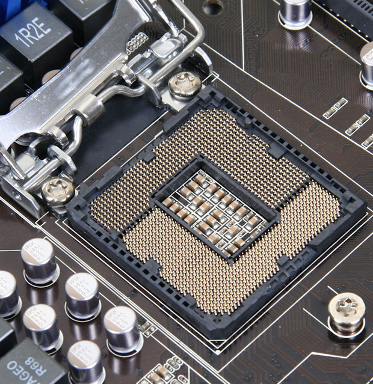

#### The chipset
so, as seen on the previous point, chipset are important. There is 3 category of chipset (on intel though): B, H and Z.

The build quality of those motherboard is nearly the same, the only thing that change is how everything is connected on the PCB and the number / quality of the features (Integrated audio chip, Wifi, Usb ports, etc)

a B chipset will be ok to run a machine, this is an entry level motherboard, usually around 40/50$, the H will add some features, but this is still a cheap and viable option. Usually those motherboard have good audio chip and integrated wifi.

The Z chipset is used only on premium motherboard, it is useful for overclocking. It also has some more features/better quality for audio chip/etc, so usually you don't need it. this also mean those motherboard are more expensive (starting at least at 150$)

*and please, do not buy a Z chipset and an i5... it's like buying a Ferrari and replacing the motor with an overpriced bicycle.*

#### I/O
check how many sata port you can have on a motherboard (more sata port = more hdd / ssd)

Check also the fan connectors: there is two type of fan, pwm (4 pin) and normal (3 pin). There is no difference between them, but they are not compatible (you can't pin a pwm on a 3 pin, and if you put a 3 pin fan on pwm, it will go full speed)
If the motherboard don't have enough fan pin, don't worry, there is splitters available on internet for a really good price (2 / 5 $)

Check the supported usb version (usb 2.0, 3.0 or 3.1) it will allow you to connect the front usb (on the front of the case)

at last, if you have no other choice than using wifi for the computer, check that the motherboard have wifi integrated, or else you will need to buy a separate expansion card or a dongle

#### note on chipset lanes
The pcie lanes of a chipset on a motherboard are not the same as the ones from the CPU. Do not sum them, it won't work.

You need to be very careful about how the motherboard connect everything if you have more than 2 GPU (remember the example of the threadripper). Depending the PCB lanes are not attributed to the CPU but the Chipset.

*The following image is two diagrams, On top there is the connections between the CPU and the "main pcie lanes" and below the chipset pcie lanes.*

#### Size:
There is multiple size of motherboard: mini ITX (smallest), micro ATX (medium), ATX (large), E-ATX (extra large) and other bigger MB (usually two socked xeon or epyc motherboard)

- Prices tend to be a little bit cheaper for micro ATX versus ATX. However you will not be able to put more than 2 GPU.

- I do not recommand micro ITX motherboard, they are more expensive and difficult to upgrade.

- For bigger Motherboard (E-ATX and beyond), you need to be carefull, this is not an usual form factor, so there will be less choice for choosing a case later.

### RAM

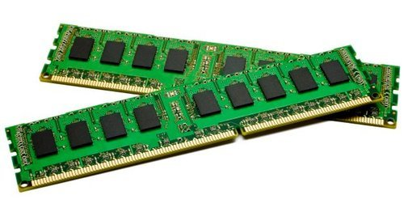

Ram is one important piece. *The minimum* Ram you should take is the same as your GPU: you need to put your dataset batch in the ram before sending it to the GPU.
*The recommended* amount of ram is the sum of the memory on your GPUs

for example:

Titan Xp *2: (12GB effective memory)

	- minimum: 16 GB of ram (12GB sticks doesn't exists)

	- recommended: 32 GB (same here, 24GB sticks does not exists)
	
Current Ram prices are crazy (there is at the moment a lawsuit against manufacturers about prices agreement between them). So this is understandable to not go for the 32 GB. Same if you want to upgrade your computer later... Motherboard have at least 2 places to put ram, so it's always a good move to only take half of the available ram slot, in order to be able to upgrade later.

Check at last their frequency: some ram can go really fast (3200Hz +) but the downside is that it's not supported by the motherboard (as for the CPU, you can easily find the maximum ram speed for every motherboard on the specs / datasheet)

At last, for compatibility, there is currently 4 generation or RAM, DDR1, 2, 3 and DDR4. **They are not backward compatible**

### Storage
So, now you need some storage.
There is 3 main type of storage, with different speed:
HDD (hard disk drive) < SSD (solid state drive) < M2 (ss2 connected with motherboard pcie lanes)

this is fun, because the price is the same.

the recommendation is:

- if you're on a tight budget, forget about SSD and M2. Linux is sufficiently optimized to be faster than windows on HDD.

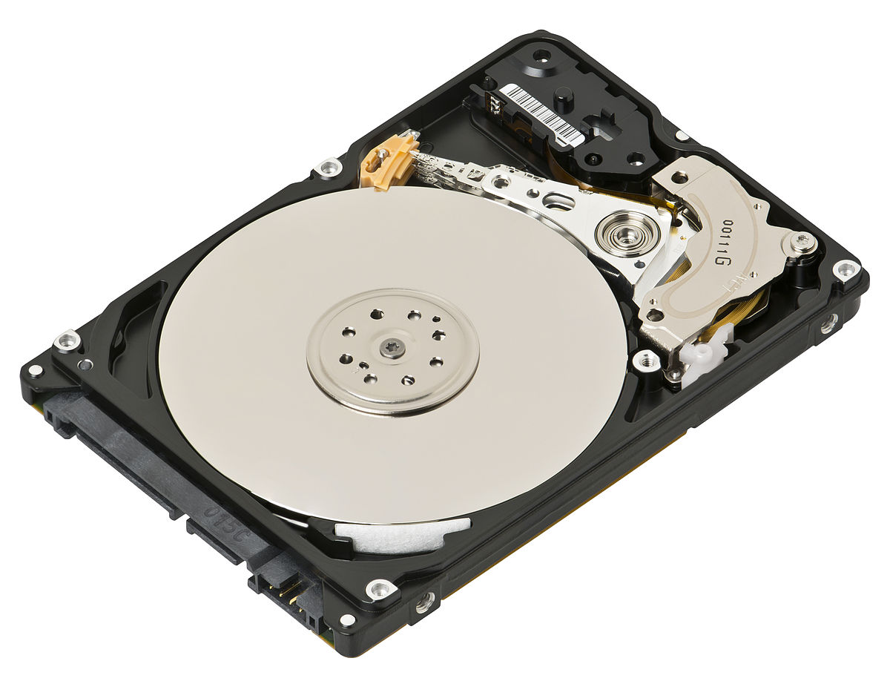

- If you have a little bit more money you can buy a SSD, but it's around 3 times / 4 times more expensive than a HDD. Your training time will be faster however since you will load nearly instantly your dataset from storage. You still need to know that SSD has limited lifetime that is calculated in regard of the number of write. So to optimise the lifetime of an SSD, try to download only once your dataset, and avoid to modify it too often (for example changing the size of training/validation folder, and moving 20GB of images each time)

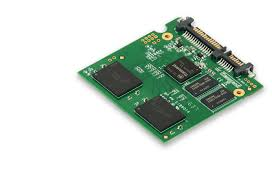

- M2 / NVME: This storage is even faster: instead of relying on SATA (data cables for SSD and HDD) they use pcie lanes. This mean very fast read/write, however, depending of the motherboard, it will eat cpu or chipset lanes (those lanes usually used for SATA 3), so not really a good choice depending of your motherboard. If you have ton of pcie lanes, this is still an improvement over SSD.

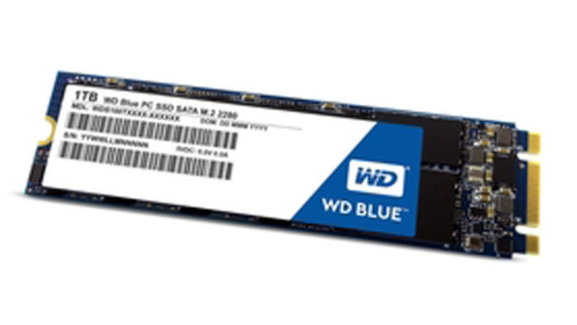

For boot / Root of your Linux system, using a ssd is not mandatory, again, Linux is faster than windows, if you tweak it you can reduce boot time significantly (one of my teachers actually achieved to boot in less than 2 seconds).
Expect however longer boot time if you are not using a Linux headless (Linux server).

It is recommended to use a separate drive for your os / boot and one or more for your data. Linux need 50 GB of storage if you put a lot of things. You can also go with 20 GB.

### Cooling the beast
There is three main kind of cooling available.

- Air: basically you put a big chunk of aluminum on your cpu / gpu, a fan, and yaay "conduction and convection" will append

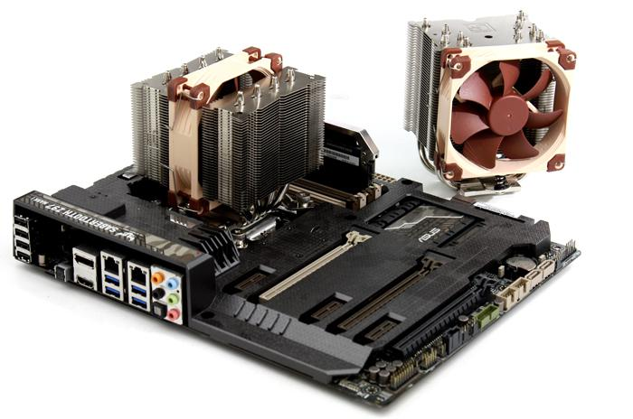

- AIO (or All In One): this is water in a closed environment. It's more stylish, but it come at a high price.

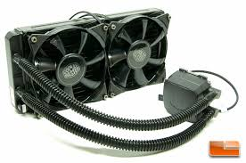

- Water cooling: here is a very stylish and useful way to cool down your components: you put pipes with water in it. since water is a very good conductive, the heat will drop a lot. However, this kind of cooling require more time to set up, and maintenance at least once a year.

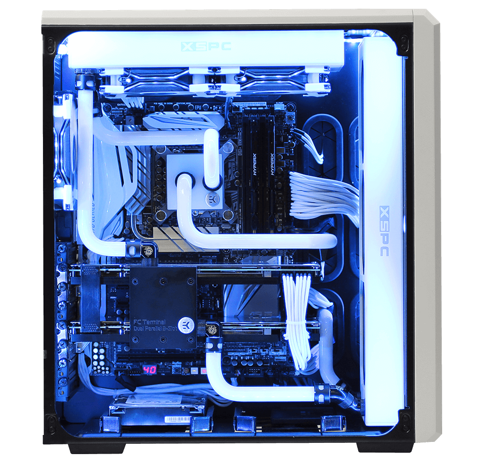

- (other): there is other kind of cooling (like Mineral oil, or phase change or nitrogen, where you cool the CPU to -50°C) . Those kind of cooling are awesome for engineering enthusiasts, and are used usually for crazy benchmarking. However, it's very complicated to set up, and clearly not worth it for deep learning.

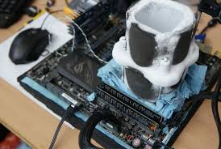

And just a side note: There is one cooler to rule them all: the Noctua NH-D15 is an absolute beast to cool down cpu. This air cooler is actually better than liquid cooling. The advantage is that this high end cooler is still cheaper than entry level AIO, and much quieter (you can turn the fan off most of the time, because the aluminum part is so massive, natural heat dissipation will be enough). It's big, but the next gen (in a couple of month) will be much smaller.

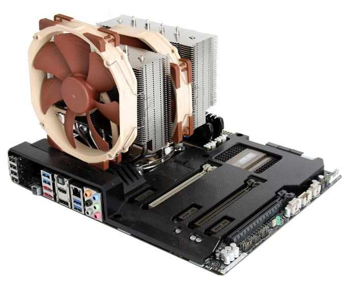

*try to put that in a laptop*

As a general advice, some of the latest air cooled GPU are also very good at keeping the temperature down even with multiple GPU. I do not recommend to go watercooling for your first build, this is a little bit harder to set up than a regular pc and only useful if you're annoyed by noise. If you're living in a relatively hot place (aka ~35°C or more) you should put AIO for better temperatures. There is fittings to put AIO on GPU as well

You can expect the following temperatures:
Air : CPU: ~50 °C / GPU: ~75 °C
Water cooling: CPU + GPU: ~30 °C

### PSU
we're nearly at the end !
So now you need something to convert electricity from the wall to you component. 
There is multiple type of PSU (power supply unit) with 3 main things to look for:

- Efficiency (80+ Bronze, silver, gold): it will indicate the efficiency of the psu. So Bronze psu will draw more power than silver ones, etc. **DO NOT TAKE A PSU WITHOUT THE 80+ LOGO**: this is an indicator of a good manufacturing. PSU without this, especially in high computation are a fire hazard.
All brand are less or more equal (if you take a PSU with the 80+ logo)

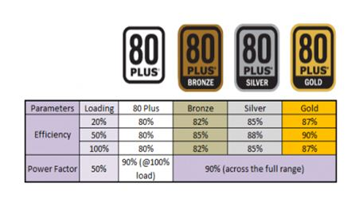

- Modularity: it means you can unplug the useless cables (for example if you only have 2 hdd, you won't need the 4 cables)
Semi modular PSU mean there is only the CPU cable that can't be unplugged

- Wattage: This is the maximum amount of watt the psu will provide.
You can find various calculators online. Be careful though, manufacturers tend to increase the wattage needed to sell more expansive psu (so don't use the manufacturers tools)
[HERE is a good calculator](https://outervision.com/power-supply-calculator)

### LED
Careful some component are shipped with led everywhere. As for all trends and gadgets, you will pay more for the leds, and sometimes the hardware (especially for fans) is weaker than other companies without led.

This is important to know that 90% of gamers are using Windows and not linux. So most of the software required to personalise / unify colors are not supported by the manufacturers on linux. There is still open-source software to deal with it (I've found some things for Razer, MSI, and it seems that gigabyte is using a bios setup for leds, thus not needing windows). Some component will be able to stay on a specified color if you have a dual boot with windows (you can then choose the color of all the leds and restart the computer on linux).

When leds are not set up, they will usually light up with a specific color and pattern (how they glow, switch on or off, etc). The less funny part is that when you can't set up all those leds to switch on at the same time and the same color, it can turn your computer into an *-ugly-* stroboscopic rainbow.

The easiest way is to no put too much leds in you build or a static unicolored hardware^^

### Fan
Just make sure the fan is 3 or 4 pin. (DC or PWM)

- DC mean the fan's motor will run more or less fast depending on the voltage given to the fan.
- PWM mean that the current pin will carry alway 12V, and the PWM pin send and receive the fan speed in RPM.

If you want reliable fan, you can go to Noctua, they are designing datacenter fan, and their guarantee is very good

### Case
spend the rest of your budget on a case. Make sure it is well ventilated, or your computer will become noisy. This is kind of easy to spot (open front and open top since heat goes up). A recent trend was to put glass panel everywere, so mind some cases that put a giant glass in front of the fan, thus making them useless.

Make sure there is enough room to put your radiators, and the motherboard. Mind also the GPU length.

### Other
If you are using Linux headless, you will need at least for installation a keyboard and a monitor.

if you plan to use Linux with a desktop, you will also need a mouse

### OS
*Not windows*: some programs are not natively supported. Also the official supported OS on most libraries is Linux

if you don't know which linux to take, this mean you have to go with ubuntu: it's an easy os for beginners in linux. It's also the official *most* supported distro.

### TLDR: some examples
If you don't want to read the previous parts... Well if you are in a hurry I can understand, but only you can design the best pc for your requirements.

here is some ideas of entry level / medium / high level / ultimate workstation, with intel and AMD, if you didn't read the guide note that intel / amd board are not compatible and you should better invest in a ATX motherboard (prices are roughly estimated because this is changing everytime, this is also why I'm listing AMD and Intel)

*entry level*
	
	AMD:
	Ryzen 5
	B chipset motherboard (like B350)
	INTEL EQUIVALENT:
	i5
	B chipset motherboard (like B250)

	8GB of ram
	nvidia 1050 ti or more depending of your budget
	HDD storage only

*medium*
	

	Ryzen 7 / i7
	B chipset motherboard

	16GB of ram
	1070/1080 ti
	HDD storage only
	if possible separate the HDD for your os and the one for data storage

*high level*

	Ryzen 7 / i7
	B or H chipset
	16-32 GB of Ram
	one 2080 ti or two 1080 ti (at the moment, 1080 ti is still a better option because it's more than half cheaper and only 15% slower)
	HDD / SSD, you must separate your OS from your data

*ultimate workstation*

	Threadripper / i9X
	there is only one chipset: x399 for threadripper and x499 for i9X
	64+ GB or ram
	4+ GPUs (for this kind of budget, you need to select between more GFlops or more GPU, or both. You can also look in more specialized card like nvidia tesla, or titan cards)

## ASICS & SOC (embedded systems)
Asic or Application Specific Integrated Circuit are processors redesigned for a specific task. The most known are Bitcoin mining asic that are very efficient for mining.

The purpose of those processors is to provide good or above average performance with a reduced consumption.

An example of ASIC for AI is Intel Nervana or Google TPU  (some core inside the Nvidia Titan V are also ASICs)

[edit: I found a cool list of asic here](https://basicmi.github.io/Deep-Learning-Processor-List/)

There is also embedded systems available (SOC or System on a Chip, like raspberry pi)

- the Nvidia Jestson

- An intel NPU

- ...

## Youtubers to follow & useful links
**[PcPartPicker:](https://pcpartpicker.com/list/)** This is the most up to date database of hardware components, you can plan here a build an estimate your budget. Another good point is that if you are doing something wrong, the website will warn you.

**[Gamers Nexus:](https://www.youtube.com/user/GamersNexus)** This channel is serious about harware, the team here is doing a great job for reviewing thermals of components and really technical reviews, PCB explanation, tech news, etc.

Pro:
- Channel for engineers / enthusiasts
- Really informative and useful
- News are also great, you can learn a lot about the hardware world
- If you don't like videos, every thing is also [written on their website](https://www.gamersnexus.net)

Con:
- can be intimidating
- Gamers focused, however this is not very noticeable

**[Level one Tech:](https://level1techs.com)** I recently found this hardware blog. It's oriented on linux for workstation and gaming

**/r:** Subreddits, don't hesitate to ask questions: this is not a gamer only forum. Beware tough (same for all sub) there is some fanboys with biased opinions.

-[/r Intel](https://www.reddit.com/r/intel/)

-[/r AMD](https://www.reddit.com/r/Amd/)

-[/r Build a pc](https://www.reddit.com/r/buildapc/) General advice

-[/r hardware](https://www.reddit.com/r/hardware/) General advice (not only computer related)

-[/r Nvidia](https://www.reddit.com/r/nvidia/)

-[/r PC Master Race](https://www.reddit.com/r/pcmasterrace/) General advice on powerful computers

-[/r Linux master race](https://www.reddit.com/r/linuxmasterrace/)
