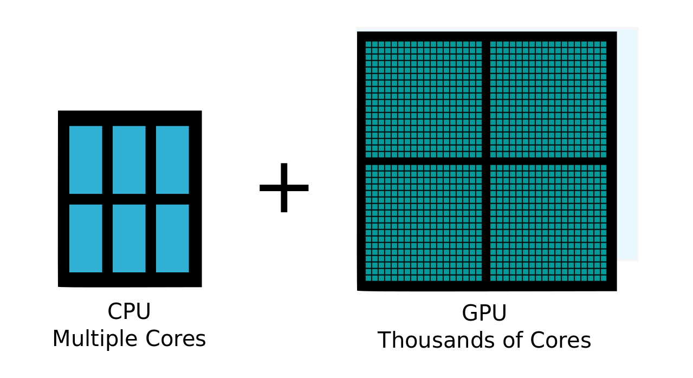

# Deep learning Hardware
The goal of this guide is to teach how computer hardware works and what is important in deep learning.
My only experience in AI so far is on personal projects and an internship in a research department of a university. So the recommendations section is made for a home-lab system or a small team.

Feel free to open an issue is there is any mistakes or any questions :)

**important note:** This guide will talk mostly about deep learning (even if I use the term AI). Machine learning algorithms do not need as much power as deep learning (you don't even need a GPU as far as I know)

# Table of content:
- [I'm a beginner / I'm a student](./HardwareforAI#im-a-beginner--im-a-student)
- [Laptop vs Cloud vs Prebuild vs Homemade](./HardwareforAI#laptop-vs-cloud-vs-prebuilt-vs-homemade)
    - [Laptops](./HardwareforAI#pro-and-con-of-beefy-laptop)
    - [Cloud computing](./HardwareforAI#cloud-computing)
    - [Prebuild](./HardwareforAI#prebuild)
    - [Homemade](.HardwareforAI#homemade)
- [The bottom-up approach: What kind of harware exist, and how to choose it](./HardwareforAI#the-bottom-up-approach-what-kind-of-harware-exist-and-how-to-choose-it)
    - [Why GPU are so efficient ?](./HardwareforAI#why-gpu-are-so-efficient-)
    - [Choosing a GPU](./HardwareforAI#choosing-a-gpu)
    - [Choosing a CPU](./HardwareforAI#choosing-a-cpu)
    - [Choosing a motherboard](./HardwareforAI#choosing-a-motherboard)
    - [RAM](./HardwareforAI#ram)
    - [Storage](./HardwareforAI#storage)
    - [Cooling the beast](./HardwareforAI#cooling-the-beast)
    - [Power Supply](./HardwareforAI#psu)
    - [LEDS](./HardwareforAI#led)
    - [Fans](./HardwareforAI#fan)
    - [Case](./HardwareforAI#case)
    - [Other](./HardwareforAI#other)
    - [OS](./HardwareforAI#os)
- [TLDR: some build examples](https://github.com/MaelAbgrall/HardwareforAI/blob/master/README.md#tldr-some-examples)

**Some additionnal contents:**
- [ASIC & SOC / Embedded systems](./HardwareforAI#asics--soc-embedded-systems)
- [Youtubers to follow & Useful links](./HardwareforAI#youtubers-to-follow--useful-links)

## TODO list:
    - Building guide
    - Deep learning asic & embedded chips
    - Resize images & better diagrams

## latest update:
    - Added some configuration ideas
    - modifications on storage
    - benchmark link for 1080ti vs 2080/2080ti

## I'm a beginner / I'm a student
Unless you like video games or studying AI, you don't need a powerful computer: a recent i3/Ryzen3 with an integrated graphic chip (iGPU or APU) is plenty for some docker containers &/or small programs.

There is plenty of cloud-based solutions that will offer free computing power for a limited time. And even when you are out of free options, it is still a viable option to do quick computing.

# Laptop, Cloud, Prebuild & Homemade
Before going any further, here is how I'm working with AI:

- I have a small laptop with enough power to do some small computation or small software (like websites for example). It's a Thinkpad x230 with an i5 under Fedora, and it serves me well since 2012, it's ultra-light and very small. I might change it because I already upgraded it to its maximum (SSD, 16go of ram, changed the thermal paste) and it's not as snappy as a recent CPU such as a Ryzen 3.

    *An idea of the size of the x230*
- My main computer for heavy computation, photoshop and gaming. Its a 9900k (16 threads), 32GB of ram, and a 1080ti. It's running a dual boot with windows, and ubuntu.

- The research dpt. of the uni I had my internship with had a xeon (32 threads), 64GB of ram and 4 titan xp and 5/6 people were working on this server.

When I'm not on my big computer, I'm using a combination of SSHFS, ssh tunnels and vscode with the remote ssh extension.

## the beefy gaming laptop
Sadly, a lot of people out here recommend getting a gaming laptop for AI.

While it is not bad advice, it is not great either. Those laptops are optimised for gaming on the go, not heavy computation. Choosing this will make you run very quickly into limitations.

Why? If you did some thermal / energy engineering, you should probably know about the things I'll talk here.

When you are running heavy computation (Games, AI, video rendering, etc) you are using a lot of power. Since our world is not perfect while doing this you lose some power in the form of heat (in electronics it's called TDP and it's in Watt)

So, when you have a laptop, your "cooling potential" aka the size of the heat exchanger / Radiator is small. Thus your laptop fans will need to run full speed to dissipate this heat. And even at full speed, it's "optimised" so the laptop will wear faster than usual.

**pro:**
- work without internet
- ready to go
- you don't need to set up/secure ssh if you work on different places (just bring your laptop)

**Con:**
- expensive
- very noisy, and heavy
- reduced lifespan due to wear and heat
- you can't upgrade it
- thermal overload (your computer will slow down to not break or burn, thus longer training)

## Cloud computing
Cloud computing is a good option if you don't have a budget or if you are not serious about AI. However, in the long run, it becomes very expensive.

**For companies (start-up and small ones)**, in case you didn't know, the most intensive part about AI is training a model. This is when you need a big computer with really powerful hardware. During prediction (for example when used by an end-user) the amazing thing is that you don't need powerful computers (yes, you can run a model on a mobile phone). So, again, for a small/medium team, building your computer is the most affordable case in the long run (>1y, do not use a DIY for an MVP). Since it's also a server used only by your team, you can easily protect it and maintain it (either by closing all ports from the outside and allowing only people on-site to work on the machine or by allowing ssh only with keys)

**pro:**
- no need for maintenance (you can start training in less than 15min)
- access to pro-level hardware is very cheap as long as you don't use it too much
- easily scalable for large teams

**con:**
- the price depends on usage

## Pre-build
Those computers are very powerful usually. There is two types of prebuilds: the ones by big companies (Asus, MSI, etc) and the ones built by smaller professionals (for example electronic hardware stores such as LDLC in France or Overclocker in the UK does that, but other very small companies can propose this too)

Prebuilds from big companies are the same as the laptops: Those companies optimise the design to be powerful while staying cheap, so they share con with gaming laptops (apart for the price)

Other prebuilds can be worth it, in essence, they are homemade computers built by someone else, the only thing is you need to pay the people who will build it, and sometimes you can't go with some particular options.

## Homemade
The best option in my opinion. You will put only what you need on your computer, this will allow a very wise usage of your money.

For those afraid of building a computer: it's not difficult (if the cable don't fit, it's not the right cable), and it's not very time consuming (you need to plan maximum two days)

**Pro:**
- Only what you need
- You can upgrade it as hardware is evolving (you only need to change a few parts, and keep 90% of your initial build)
- Depending on the hardware, it can be silent, or extremely silent
- It's very efficient because you will never have a thermal overload.
- You can make a VERY powerful computer (aka 8 GPU)
- In the long run, the cheapest option

**Con:**
- It's very heavy
- It's big
- you need a bit of time to check all the parts are compatibles
- you need to install yourself the software needed
- It's a vacuum cleaner, so you need some cleanup from time to time (it's not mandatory, but you can loose performance if it's too dusty)

when you are using a homemade setup, if you are outside, you only need an internet connection and a small laptop to connect to it. You may even not need to buy a new laptop because you are probably reading this on a portable "computer" (aka something with a keyboard is enough).
Even a Chromebook will be enough to work remotely.

If you want to buy a new laptop, there are very good Linux laptops out here, Clevo notebooks are worth it (the original Alienware were built with Clevo notebooks), and some re-vendors like System 76 in the US are supporting Linux

# The bottom-up approach: What kind of hardware exists, and how to choose it
To build a computer you will need at least a motherboard, a CPU, Ram, and storage (HDD / SSD / M2).
Some CPU (Intel primarily) have integrated graphics. It's a very weak GPU, but it's enough for rendering a desktop environment and basic applications (Office, internet, etc).

## GPU
### Why GPUs are so efficient?
A GPU is a specialized piece of hardware originally made for rendering pixels.

Since they are specialized in something, they are not good for all tasks: if you need a state machine with instructions that depend from the result of previous ones, CPUs are still more efficient.

If we are doing for example 1+1, a GPU core will be slower than a CPU core. The magic lies in parallelism: a GPU has thousands of cores when a CPU have only a few. So when you have a problem that can be parallelized (example render pixels or calculation with matrices) GPU are much more efficient than a CPU.

Deep learning tasks can be parallelized, this is why you need a GPU. (Machine learning is not as far as I know, so you don't need a GPU for that)

At last, GPUs have a very high-speed memory (GDDR), so communication between GPU <-> GDDR is faster than CPU <-> RAM

If you want an example: I did a training with my old x230 on MNIST. using the CPU, it took nearly 3 days.
On my big computer, it took 5 minutes

### Choosing a GPU

*this square on the middle is the graphic chip. the smaller squares around it are memory modules*

When you are building a deep-learning computer, the main concern is the GPU, how many? how efficient?

2 things are important in a GPU (the more, the better):
- Memory: Less memory means either smaller batch or only one model at a time
- Processing power (in GFLOPs): this is the number of operation per second, more flops means faster training.

Processing power is usually constrained by the number of cores, clock speed and GDDR bandwidth.

You can find all Nvidia's GPU datasheet [here for 9xx series](https://en.wikipedia.org/wiki/List_of_Nvidia_graphics_processing_units#GeForce_900_series) and [here for the 10xx series](https://en.wikipedia.org/wiki/List_of_Nvidia_graphics_processing_units#GeForce_10_series)

At the time of writing this guide, the Titan V is well above the other cards in term of processing power.

update: [this link](https://www.pugetsystems.com/labs/hpc/NVIDIA-RTX-2080-Ti-vs-2080-vs-1080-Ti-vs-Titan-V-TensorFlow-Performance-with-CUDA-10-0-1247/) is a quick benchmark for 1080ti vs 2080 and 2080ti.

Depending on the size of your datasets and the number of experiment you need to conduct at the same time, you can either go with one beefy GPU or two smaller ones (or if you can afford it, two big GPU).
    
*Since you can upgrade your computer later, a tight budget choice would be to use every time two GPU: one powerful and one less powerful / older.*
    
- *You will be able to train multiple models at the same time on both cards for testing, and use the most powerful for more longer training.*
- *you will also be able later to upgrade only one GPU at a time (always change the older when buying new hardware)*

*Previous generation hardware (ex 980ti) is a good value, and still efficient if you can find some in good condition.*
    
*note: I'm not sure you can play video games on this kind of setup, however for computation, it is fine to have two, three, four or more different Nvidia cards on the same computer*

For example, with a Titan XP (12GB) you can train 5 CIFAR datasets at the same time with batches of 500 images.

some simple math to estimate roughly your GPU memory need: Batch size(int) * image size(KB/MB) = more or less the ram needed during training

If you are choosing between Nvidia and AMD, at the moment (2018), Nvidia is much more advanced on AI than AMD, so there is no doubt: go for Nvidia

Last note on GPUs:
Going for 1 or 2 GPU is okay if you plan to put more than 2 GPU, it will cost you much more to run it (explanation on the part on PCIe lanes)

## CPU
### what is it and how is it used in deep learning?

*backside of a CPU, those little dots will connect to the socket*

Choosing a CPU for AI is not the same as choosing a CPU for gaming.

When you are gaming, GPU performances are bounded to the CPU ability since a lot of work is done on the CPU. When you use a less efficient CPU: the GPU is waiting for CPU instructions.

Since AI don't do the same computation, you do not have the issue of a CPU bottleneck. I still recommend at least an i5 / Ryzen 5 / equivalent

How is the CPU used in Deep learning? During training, the CPU is used for data preparation (pre-processing) before sending it to the GPU & all things that are not related to the training part. In Keras for example, when using the data augmentation, the CPU will read the folder, prepare the data according to what you want, and feed it to the GPU for training.

In the deep learning case, the slow part of the software is training, and it's happening on the GPU. Since even the best GPU will not train as fast as a CPU can do data augmentation, you will never experience CPU bottleneck.

### Number of core
The number of core in a CPU is not very relevant in deep learning, it is interesting to have more than 2 cores for preparing batches of data. Unless you use very heavy multi-threaded pre-processing or if there are multiple users on the same computer, the need of more than 4 cores is not relevant (it is better to search for a fast CPU than a huge number of cores).

In machine learning, more cores might be more interesting if you can parallelize your training (or if you need lots of threads/processes anyway). 

If you plan to use >=3 GPU, nearly all CPU that can handle this have more than 8 cores

### the generation
intel CPUs are usually called iX (i3/i5/i7/i9) AMD CPUs are usually called RyzenX. AMD is currently (2019) proposing a line of CPU more interesting than intel.

You should check the generation of the CPU: newer CPUs are more efficient than older ones, this means reducing the electric bill, and better performances. Be careful i7 i5 Ryzen 5 / 7 is not the generation, it is the performance indicator.
    example:
- i7 7700 is generation 7, with a perf. indicator of 7
- i5 8600 is generation 8, with a perf. indicator of 5

the performance scale is as follow:
    
    lesser CPU (celeron, etc) < i3 / Ryzen 3 < i5 / Ryzen 5 < i7 / Ryzen 7 < i9 / Ryzen 9

AMD Threadrippers are not on this scale since they are not necessarily better than i9/R9, they have more core and a different way to communicate with the motherboard, but those core are slower than i9/R9.
    
Intel Xeon and AMD Athlon/Epyc are special kinds of CPU, usually expensive because they have features used mainly in datacenters (lots of core, but not very fast)

### PCIE Lanes
the number of pcie lanes. Consumer-grade CPU will usually come with 16 lanes. PCIe lanes are the communication pipes between the CPU and the GPU. A GPU will take maximum 16 lanes, and (for CUDA based application) minimum 8 lanes.

Having only 16 lanes, those GPU need to divide them between the two GPU if you have two. This means a 10% decrease in performance. **I believe that the next PCIe (generation 4) will enhance/remove this**. 

If you need to plug more GPU, you need more lanes. Be careful though, splitting lanes is not even (for example the i7 X series have 28 lanes. However it is split in 16x 8x 4x, so you won't be able to put a third GPU) Usually the only CPUs allowing enough lanes for 3+ GPUs are Threadrippers and datacenter CPUs. However, it is much more expensive than a i9/R9 and the motherboard you will need is also more expensive.

*Used datacenter hardware can also be interesting if you are on a budget since they have more PCIe lanes*

*The following diagram is not accurate (we will see why later), but you get the idea about GPUs. This is a Threadripper*

### Overclocking
Some intel CPU are overclockable (all AMD CPU are).
This is a special feature that allows drawing as much efficiency as possible from the CPU.
If it's useful for gaming, it is a terrible idea for computation: Not only doing the right overclocking is time-consuming, but will decrease the stability of your hardware, increase heat and power consumption (at best introduce errors, at worst wear and break the CPU) **It's a no no.**

On top of that, this "feature" is a bit more expensive at intel since it requires K processors (more expensive) and Z motherboards (more expensive too)

If you still want an overclockable CPU from intel: it won't harm your computation if you don't overclock it. And you can benefit from higher factory clock speed.

### General knowledge about CPU / good to know
CPUs are mainly divided into two categories (but there is other of course): ARM chips that are present in most of the small 'computers' like phones or embedded systems, and x86 chips. 

x86 is an instruction set developed by intel and (if I remember correctly) only used by rarely allowed companies such as AMD.

Basically: 

- ARM is usually (not all the time) more power-efficient.

- x86 usually outperform ARM.

## Choosing a motherboard
In the past, motherboards quality was very important. This is no longer the case. You still need to check some things

### compatibility
**The most important part of choosing a motherboard:**

A CPU needs two things to connect to the other components in your computer: a socket (that physically connect it to the motherboard) and a chipset (another chip that helps to communicate with other components)

so you need to be very careful: some chipset (ex: 270 & 260) have the same socket (lga 1151) but they won't be compatible with their respective CPU
(by memory, 270 is for 7 gen Intel CPU, and 260 for 6th gen)

Don't worry, you can easily find the compatibility (CPU vendors are listing the compatible socket & chipset)

Mind also if you need to do a bios update. This means you need first a compatible CPU to update the bios before using the one you want.

*this is a socket:*

### Chipset
so, as seen on the previous point, chipsets are important. There is 3 category of chipsets: B, H and Z with intel, and A, B and X with AMD.

The build quality of those motherboards is nearly the same, the only thing that change is how everything is connected on the PCB and the number / quality of the features (Integrated audio chip, Wifi, Usb ports, etc)

a B/H/A chipset will be ok to run a machine, this is an entry/mid-level motherboard, usually around 40/50$.

The Z/X chipset is used only on a premium motherboard. It also has more features/better quality for audio chip/etc, so usually, you don't need it. this also means those motherboards are more expensive (starting at least at 150$)

### note on chipset lanes
The PCIe lanes of a chipset are not the same as the ones from the CPU. Do not sum them, it won't work.

You need to be very careful about how the motherboard connect everything if you have more than 2 GPU (remember the example of the Threadripper). Depending on the PCB lanes are not attributed to the CPU but the Chipset.

*The following image is two diagrams, On top there is the connections between the CPU and the "main PCIe lanes" and below the chipset PCIe lanes.*

### I/O
check how many SATA port you can have on a motherboard (more SATA port = more drives)

Check also the fan connectors: If the motherboard doesn't have enough fan pin, don't worry, there are splitters available on internet for a really good price (2 / 5 $)

at last, if you have no other choice than using wifi for the computer, check that the motherboard have wifi integrated, or else you will need to buy a separate expansion card or a dongle

### Size:
There are multiple standard sizes of motherboards: mini ITX (smallest), micro ATX (medium), ATX (large)

- Prices tend to be a little bit cheaper for micro ATX versus ATX. However, you will not be able to put more than 2 GPU.

- I do not recommend micro ITX motherboard, they are more expensive and difficult to upgrade.

- E-ATX, a bigger form factor exists, however it is not a standard so you might run into a compatibility problem with your case.

## RAM

Ram is one important piece. *The minimum* Ram you should take is the same as your GPU: you need to put your dataset batch in the ram before sending it to the GPU.
*The recommended* amount of ram is the sum of the memory on your GPUs

for example:

Titan Xp *2: (12GB effective memory)

    - minimum: 16 GB of ram (12GB sticks doesn't exists)

    - recommended: 32 GB (same here, 24GB sticks does not exists)
    
Check at last their frequency: some ram can go fast (3200Hz +) but the downside is that it's not always supported by the motherboard (as for the CPU, you can easily find the maximum ram speed for every motherboard on the datasheet)

At last, for compatibility, there is currently 4 generation or RAM, DDR1, 2, 3 and DDR4. **They are not backward compatible**

## Storage
So, now you need some storage.
There is 3 main type of storage, with different speed:
HDD (hard disk drive) < SSD (solid state drive) < M2 (ss2 connected with motherboard pcie lanes)

the recommendation is:

- if you're on a tight budget, forget about SSD and M2. HDDs are slow but inexpensive.

- If you have a little bit more money you can buy an SSD, but it's around 3 times / 4 times more expensive than an HDD. Your training time will be faster however since you will load nearly instantly your dataset from storage. You still need to know that SSD has a limited lifetime that is calculated with the number of writes. So to optimise the lifetime of an SSD, try to download only once your dataset, and avoid to modify it too often (for example changing the size of training/validation folder, and moving 200GB of images each time)

- M2 / NVME: This storage is even faster: instead of relying on SATA (data cables for SSD and HDD) they use PCIe lanes. This means very fast read/write, however, depending on the motherboard, it will eat CPU or chipset lanes (those lanes usually used for SATA 3), so not always a good choice depending on your motherboard. If you have a ton of PCIe lanes, this is still an improvement over SSD.

Game computers are usually using an SSD to boot and store the OS. It is not mandatory in Linux since it's usually faster than windows, and a headless Linux is much faster to boot (28s on a 7200rpm HDD for ubuntu, one of my teachers achieved to boot in less than 2 seconds). 

However, if you plan to use this computer for another usage (going on internet, etc) an SSD would be a nice addition.

It is recommended to use a separate drive for your os/boot and one or more for your data. Linux needs 50 GB of storage if you put a lot of things. You can also go with 20 GB.

## Cooling the beast
There are three main kinds of cooling available.

- Air: you put a big chunk of aluminium on your CPU / GPU, a fan, and yaay "conduction and convection" will happen (it is called a radiator)

- AIO (or All In One): this is water in a closed environment. It's more stylish, but it comes at a high price. Using this can introduce a point of failure in your system.

- Water cooling: a very stylish and useful way to cool down your components: you put pipes with water in it. since water is a very good conductive, the heat will drop a lot when you use bigger radiators. However, this kind of cooling requires more time to set up & maintenance at least once a year. However, a good water cooling system is more reliable than an AIO and more efficient.

- (other): there are other kinds of cooling (like Mineral oil, phase change or nitrogen, where you cool the CPU to -50°C). Those kind of cooling are awesome for engineering enthusiasts and are used usually for crazy benchmarking. However, it's very complicated to set up, and not appropriate for anything else than state of the art performances.

And just a side note: There is one cooler to rule them all: the Noctua NH-D15 is an absolute beast to cool down CPUs. This air cooler is better than some AIO. The advantage is that this high-end cooler is still cheaper than entry-level AIO, and much quieter (you can turn the fan off most of the time because the aluminium part is so massive that natural heat dissipation will be enough).

*try to put that in a laptop*

As general advice, some of the latest air-cooled GPUs are also very good at keeping the temperature down even with multiple GPU. I do not recommend to go water-cooling for your first build, this is a little bit harder to set up than a regular pc and require to be very careful when designing it.

You can expect the following temperatures:
Air : CPU: ~50 °C / GPU: ~75 °C
Water cooling: CPU + GPU: ~30 °C

## PSU
we're nearly at the end!
So now you need something to convert electricity from the wall to your component. 
There are multiple types of PSU (power supply unit) with 3 main things to look for:

- Efficiency (80+ Bronze, silver, gold): it will indicate the efficiency of the PSU. So Bronze PSU will draw more power than silver ones, etc. All brands are less or more equal (if you take a PSU with the 80+ logo)

- Modularity: it means you can unplug the useless cables (for example if you only have 2 hdd, you won't need the 4 cables)
Semi modular PSU mean there is only the CPU cable that can't be unplugged

- Wattage: This is the maximum amount of watt the PSU will provide.
You can find various calculators online. Be careful though, manufacturers tend to increase the wattage needed to sell more expansive PSU (so don't use the manufacturer's tools)
[HERE is a good calculator](https://outervision.com/power-supply-calculator)

 **IMPORTANT NOTE**: The PSU is very important in the system because if it dies, it can damage everything in your machine. Double-check the wattage requirement and never take a PSU without the 80+ logo, this is an indicator of good manufacturing. A PSU without this 80+ is a fire hazard.

### LED
Some components are built with LED everywhere. As for all trends and gadgets, you will pay more for those, and sometimes the hardware (especially for fans) is weaker than other companies that don't use LEDs.

This is important to know that most gamers are using Windows and not Linux. So most of the software required to personalise colours or simply switch those LEDs off are not supported on Linux. There is still open-source software to deal with it (I've found some things for Razer, MSI, and it seems that Gigabyte is using a bios setup for LEDs, thus not needing windows). Some component will be able to stay on a specified colour if you have a dual boot with windows (you can then choose the colour of all the LEDs and restart the computer on Linux).

When LEDs are not set up, they will usually light up with a specific colour and pattern. The less funny part is that when you can't set up all those LEDs, it can turn your computer into an *-ugly-* stroboscopic rainbow.

The easiest way is to avoid those components if possible. It will also reduce your power consumption.

## Fan
There is two types of fan, PWM (4 pins) and DC (3 pins). There is no difference between them, but they are not compatible (if you put them in the wrong slot, the fan will turn at full speed)

- DC means the fan's motor will run more or less fast depending on the voltage given to the fan.
- PWM means that the current pin will carry always 12V, and the PWM pin sends and receives the fan speed in RPM.

Some motherboard can adapt to both types of fan, you only need to specify it in the bios.

If you want a reliable fan, you can go to Noctua, they are designing datacenter fan, and their guarantee is very good

## Case
spend the rest of your budget on a case. Make sure it is well ventilated, or your computer will become noisy. This is kind of easy to spot (open front and open top since heat goes up). A recent trend was to put glass panel everywhere, so mind some cases that put a giant glass in front of the fan, thus making them useless.

Make sure there is enough room to put your radiators and the motherboard. Mind also the GPU length.

## Other
If you are using Linux headless, you will need at least for installation a keyboard and a monitor.

if you plan to use Linux with a desktop, you will also need a mouse

## OS
*Not windows*: some programs are not natively supported. Also, the official supported OS on most libraries is Linux

if you don't know which Linux to take, this means you have to go with ubuntu: it's an easy os for beginners in Linux. It's also the official *most* supported distro.

# TLDR: some examples
If you don't want to read the previous parts... Well if you are in a hurry I can understand, but only you can design the best pc for your requirements.

here are some ideas of entry level/medium /high-level workstation, with intel and AMD, if you didn't read the guide note that intel / AMD board are not compatible and you should better invest in an ATX motherboard.

*entry level*
    
    AMD:
    Ryzen 5
    B chipset motherboard or A (like B350)
    INTEL EQUIVALENT:
    i5
    B chipset motherboard or H (like B250)

    8GB of ram
    nvidia 1050 ti or more depending of your budget
    HDD storage only

*medium*
    

    Ryzen 7 / i7
    B/A/H chipset motherboard

    16GB of ram
    1070/1080 ti
    HDD storage only
    if possible separate the HDD for your os and the one for data storage

*high level*

    Ryzen 7 / i7
    B/H/A chipset
    16-32 GB of Ram
    one 2080 ti or two 1080 ti (at the moment, 1080 ti is still a better option because it's more than half cheaper and only 15% slower)
    HDD / SSD, you must separate your OS from your data

*ultimate workstation*

    Threadripper / i9X
    there is only one chipset: x399 for threadripper and x499 for i9X
    64+ GB of ram
    4+ GPUs (for this kind of budget, you need to select between more GFlops or more GPU, or both. You can also look in a more specialized card like Nvidia tesla, or titan cards)

## ASICS & SOC (embedded systems)
ASIC or Application Specific Integrated Circuit are processors designed for a specific task. The most known are Bitcoin mining ASICs that are very efficient for mining.

The purpose of those processors is to provide good or above-average performance with reduced consumption.

An example of ASIC for AI is Intel Nervana or Google TPU  (some core inside the Nvidia Titan V are also ASICs)

[edit: I found a cool list of ASIC here](https://basicmi.github.io/Deep-Learning-Processor-List/)

There are also embedded systems available (SOC or System on a Chip, like a raspberry pi)

- the Nvidia Jestson

- An intel NPU

- ...

## Youtubers to follow & useful links
**[PcPartPicker:](https://pcpartpicker.com/list/)** This is the most up to date database of hardware components, you can plan here a build an estimate your budget. Another good point is that if you are doing something wrong, the website will warn you.

**[Gamers Nexus:](https://www.youtube.com/user/GamersNexus)** This channel is serious about harware, the team here is doing a great job for reviewing thermals of components and really technical reviews, PCB explanation, tech news, etc.

Pro:
- Channel for engineers / enthusiasts
- Really informative and useful
- News are also great, you can learn a lot about the hardware world
- If you don't like videos, everything is also [written on their website](https://www.gamersnexus.net)

Con:
- can be intimidating
- Gamers focused, however, this is not very noticeable

**[Level one Tech:](https://level1techs.com)** I recently found this hardware blog. It's oriented on Linux for workstation and gaming

**/r:** Subreddits, don't hesitate to ask questions: this is not a gamer only forum. Beware tough (same for all sub) there is some fanboys with biased opinions.

-[/r Intel](https://www.reddit.com/r/intel/)

-[/r AMD](https://www.reddit.com/r/Amd/)

-[/r Build a pc](https://www.reddit.com/r/buildapc/) General advice

-[/r hardware](https://www.reddit.com/r/hardware/) General advice (not only computer-related)

-[/r Nvidia](https://www.reddit.com/r/nvidia/)

-[/r PC Master Race](https://www.reddit.com/r/pcmasterrace/) General advice on powerful computers

-[/r Linux master race](https://www.reddit.com/r/linuxmasterrace/)
